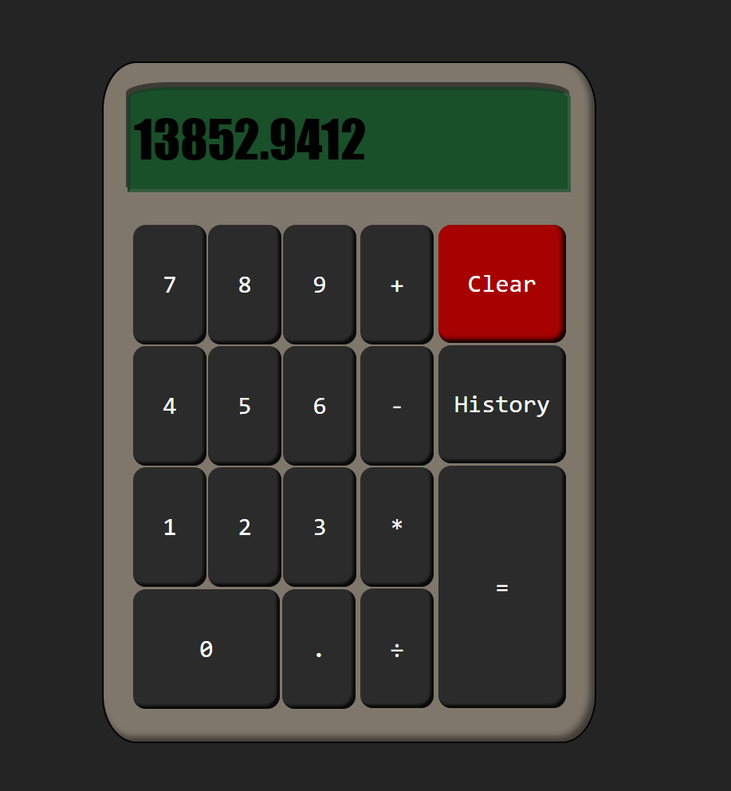

# Vintage Calculator
## Description
  
- Reason behind the project: To create a simple calculator app with a vintage UI
  
## Table of Contents (Optional)
  
- [Installation](#installation)
- [Usage](#usage)
- [Credits](#credits)
- [License](#license)
- [Tests](#tests)
- [Questions](#questions)
  
## Installation

Follow the link provided in the README.md

## Usage
  
Application functions on two factor arithmetic operations such as addition, subtraction, multiplication and division. Use two factors, select an operator, and see the result.

https://frivera14.github.io/CalculatorApp/

Screenshot attatched
  

  
## Credits
  
Collaborators: None
  
## License
  
Unlicensed

## Questions
  
All questions and communications can be directed to:
Github: https://github.com/frivera14/ 
